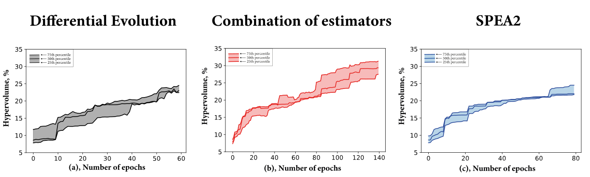
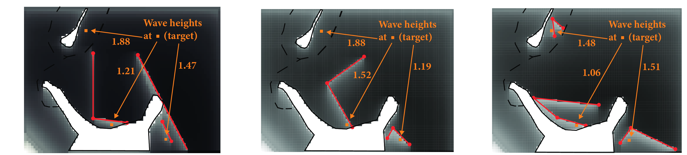

# GEFEST-paper-experiments
The repository contains the experimental studies for "Evolutionary Generative Design of Physical Objects with GEFEST framework" paper.

The experimental setup consists of:

- Synthetic cases:
  - design of structures with various number of polygons in optimal solution - [script](./synthetic/num_polygons/number_of_objects.py)
  - design of structures with various number of vertices in optimal solution - [script](./synthetic/num_vertices/number_of_vertices.py)
  - design of structures with various number of search domain size - [script](./synthetic/domain_size/domain_size.py)
- Breakwaters design case study:
  - breakwaters design based on differential evolution - [script](./real-world/breakwaters/breakwaters_de.py)
  - breakwaters design based on SPEA2 - [script](./real-world/breakwaters/breakwaters_SPEA2.py)
  - breakwaters design based on combination of surrogate and physics-based models - [script](./real-world/breakwaters/breakwaters_surr.py)
- Microfluidic device case study:
  - microfluidic design based on Generative Neural Network - [script](./real-world/microfluidic/microfluid_GNN.py)
  - microfluidic design based on GEFEST Standard Sampler - [script](./real-world/microfluidic/microfluid_GSS.py)
- Heat-source system design:
  - heat-source design based on Generative Neural Network and Deep learning estimator - [script](./real-world/heat/heat_deep.py)
- Oil field design case study.

GEFEST framework is available in [main repository](https://github.com/ITMO-NSS-team/GEFEST).

---

## Results
- ### Breakwaters
  Below are the convergence results in terms of _hypervolume_ and the best configurations found by each toolkit 
  are presented.    

  &nbsp;&nbsp; &nbsp; &nbsp; &nbsp; &nbsp;&nbsp;__Differential__ __evolution__ &nbsp;
  &nbsp; &nbsp; &nbsp; &nbsp; &nbsp; &nbsp; 
   __Combination of estimators__ &nbsp; &nbsp; &nbsp; &nbsp;&nbsp;&nbsp;
  &nbsp;&nbsp;&nbsp;&nbsp;&nbsp;&nbsp;&nbsp;&nbsp;&nbsp;&nbsp;&nbsp;&nbsp;&nbsp;&nbsp; __SPEA2__

  
   

- ### Microfluidics
  Convergence of the target variable and the best found objects by each toolkit are presented.    
  
  

  <b>Generative Neural Network</b>
  &nbsp;&nbsp;&nbsp;&nbsp;&nbsp;&nbsp;&nbsp;&nbsp;&nbsp;&nbsp&nbsp
  <b>GEFEST Standard Sampler</b>
  
  

  

  
  
  

- ### Heat source
  The best average temperature found in the design process is presented.    
  

  &nbsp;&nbsp;&nbsp;&nbsp;&nbsp;&nbsp;&nbsp;&nbsp;&nbsp;&nbsp;&nbsp;
    <b>Generative sampler and Deep learning estimator</b>
  

  

  